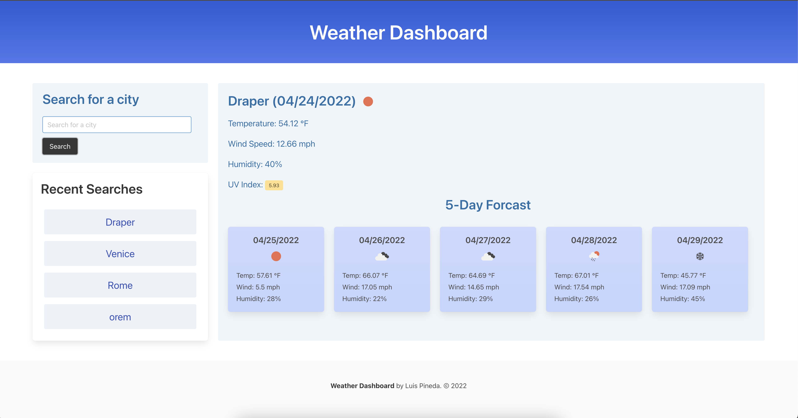

# weatherDashboard - Challenge 6
## Description
Build a weather dashboard that will run in the browser and feature dynamically updated HTML and CSS.

Use the OpenWeather One Call API (Links to an external site.) to retrieve weather data for cities. Read through the documentation for setup and usage instructions. You will use localStorage to store any persistent data.

## Acceptance Criteria
- When a user searches for a city:
    - User will be shown current and future conditions 
    - The city is added to the search history.
- When a user views the current conditions for that city: 
    - User is presented with the city name, the date, an icon representation of the weather
    - When user view's the UV Index: 
        - User will be presented with a color that indicated whether the conditions are favorable, moderate or severe. 
- When user views the future weather conditions for that city: 
    - User is presented with a 5 day forecast that displays:
        - The date
        - An Icon representation of weather conditions
        - The temperature
        - The wind speed
        - The Humidity
- If the user clicks on a city in the search hitstory:
    - The user is presented with the current and future conditions for that city
## Screenshot

<h2>Link to functioning website</h2>
<a href="https://lrpineda.github.io/weatherDashboard/"> Click Here</a>

